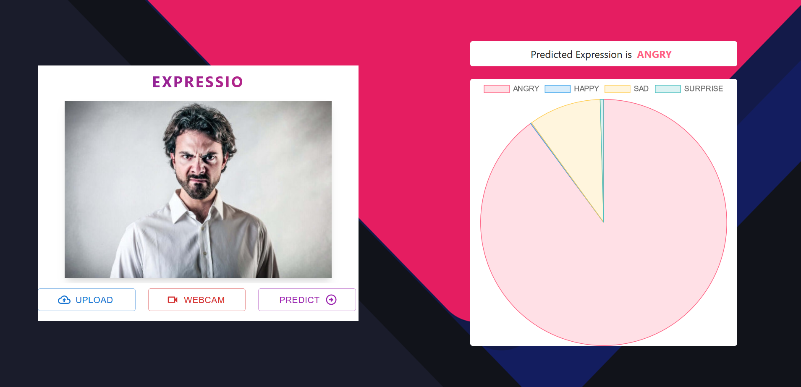
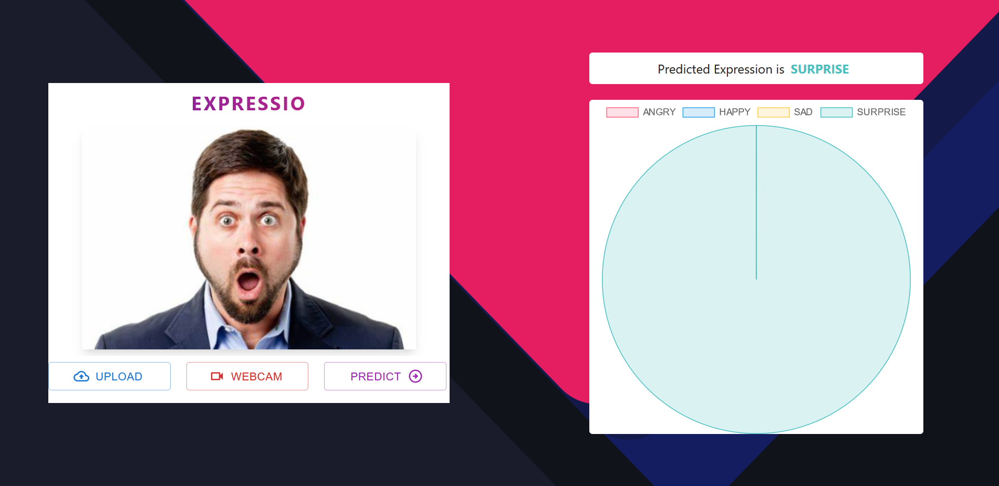

<h3>Table of Contents</h3>
<ul>
    <li><a href="#introduction">Introduction</a></li>
    <li><a href="#overview">Overview</a></li>
    <li><a href="#implementation">Implementation</a></li>
    <li><a href="#installation-and-setup">Installation and Setup</a></li>
    <li><a href="#usage">Usage</a></li>
    <li><a href="#results-and-performance">Results and Performance</a></li>
    <li><a href="#future-work">Future Work</a></li>
    <li><a href="#team">Team</a></li>
</ul>

<h3 id="introduction">Introduction</h3>
<div>
    Facial expressions are the cornerstone of human communication, serving as powerful indicators of emotions, intentions, and social cues. From a smile indicating happiness to a furrowed brow signaling concern, facial expressions play a fundamental role in interpersonal interactions. Understanding and interpreting these expressions are crucial not only for effective communicationbut also for various fields such as psychology, human-computer interaction, and artificial intelligence.
    <br>
    In today's digital age, the ability to recognize and analyze facial expressions has become increasingly important, with applications ranging from sentiment analysis in customer service to emotion detection in healthcare and entertainment. Harnessing the power of facial expression recognition technology opens up a myriad of possibilities for enhancing human-computer interaction, improving user experiences, and developing innovative solutions across diverse domains. 
    <br>
    Through leveraging advanced computer vision techniques and machine learning algorithms, the facial expression recognizer app aims to empower users with the ability to accurately interpret and respond to facial expressions in real-time, revolutionizing the way we interact with technology and each other.
</div>

<h3 id="overview">Overview</h3>

```
                                +-----------------------------+
                                |        User Interface       |
                                |       (ReactJS Frontend)    |
                                +-------------+---------------+
                                              |
                                              |
                                              v
                                +-----------------------------+
                                |         Web Server          |
                                |       (Flask Backend)       |
                                +-------------+---------------+
                                              |
                          +-------------------|--------------------+
                          |                   |                    |
                          |                   |                    |
                          v                   v                    v
                +------------------+  +-----------------+  +-----------------+
                | Image Processing |  | Data Processing |  | Model Inference |
                |  (OpenCV, PIL)   |  |  (Flask Routes) |  |  (ML Models)    |
                +--------+---------+  +--------+--------+  +--------+--------+
                         |                    |                    |
                         v                    v                    v
                +------------------------------------------------------------+
                |                         Firebase                           |
                |                       (Blob Storage)                       |
                +------------------------------------------------------------+
                                              |
                                              |
                                              v
                                +-----------------------------+
                                |    Storage and Retrieval    |
                                |        of User Image        |
                                +-----------------------------+
                                              |
                                              v
                                +-----------------------------+
                                |       Prediction Result     |
                                |      Sent Back to Frontend  |
                                +-------------+---------------+
                                              |
                                              |
                                              v
                                +-----------------------------+
                                |         Display Result      |
                                |       (ReactJS Frontend)    |
                                +-----------------------------+
```

<h3 id="implementation">Implementation</h3>
<h4>Building the Application</h4>

Expressio is driven by a vision to revolutionize the field of facial expression analysis. It stands as a <b>web-based facial recognition application</b>, crafted to predict four fundamental human expressions – <b>anger, surprise, sadness, and happiness</b>.

Powered by a dynamic technology stack, Expressio leverages <b>ReactJS</b> for its frontend, ensuring a sleek and intuitive user interface that captivates users from the moment they engage with the application. On the backend, <b>Flask</b> orchestrates the operations seamlessly, handling data processing and model inference with efficiency and reliability.

Given the central role of image processing in Expressio's functionality, <b>Firebase</b> emerges as a cornerstone of its architecture, providing a robust blob storage solution. This enables the seamless storage and retrieval of user images, pivotal for predicting facial expressions in an accurate manner.

<h4>Training the Model</h4>
For training the model, I used the <b>FER2013</b> dataset, which is part of the famous Facial Expression Recognition (FER) Challenge. It is a CSV file that contains three columns, as demonstrated below.
<br><br>

<br><br>
The original dataset comprises a total of 7 expressions, namely: <b>Happy, Sad, Angry, Surprise, Disgust, Neutral, and Fear</b>. However, it is essential to note that the dataset is unbalanced. This imbalance necessitates attention, as indicated by the graph illustrating the non-uniform distribution of expressions.
<br><br>

<br><br>
Upon analyzing the distribution of various emotions, I made the decision to focus on four expressions: <b>Happy, Sad, Angry and Surprise</b>. This decision was influenced by several factors. Firstly, there was a notably low count of samples, such as those in the "Disgust" class. Additionally, upon manual review of the images, samples labeled as "Neutral" exhibited similarities with both "Happy" and "Sad" expressions. Similarly, samples labeled as "Fear" showed similarities with those in the "Sad" class. This observation was further confirmed by building a model on these classes and analyzing the performance.

<br>

To build the Emotion Recognition model, I constructed a <b>Deep Convolutional Neural Network (DCNN)</b> leveraging the <b>Nadam</b> optimizer. Below is the architecture of the network:

```
Model: "DCNN"
_________________________________________________________________
Layer (type)                 Output Shape              Param #   
=================================================================
conv2d_1 (Conv2D)            (None, 48, 48, 64)        1664      
_________________________________________________________________
batchnorm_1 (BatchNormalizat (None, 48, 48, 64)        256       
_________________________________________________________________
conv2d_2 (Conv2D)            (None, 48, 48, 64)        102464    
_________________________________________________________________
batchnorm_2 (BatchNormalizat (None, 48, 48, 64)        256       
_________________________________________________________________
maxpool2d_1 (MaxPooling2D)   (None, 24, 24, 64)        0         
_________________________________________________________________
dropout_1 (Dropout)          (None, 24, 24, 64)        0         
_________________________________________________________________
conv2d_3 (Conv2D)            (None, 24, 24, 128)       73856     
_________________________________________________________________
batchnorm_3 (BatchNormalizat (None, 24, 24, 128)       512       
_________________________________________________________________
conv2d_4 (Conv2D)            (None, 24, 24, 128)       147584    
_________________________________________________________________
batchnorm_4 (BatchNormalizat (None, 24, 24, 128)       512       
_________________________________________________________________
maxpool2d_2 (MaxPooling2D)   (None, 12, 12, 128)       0         
_________________________________________________________________
dropout_2 (Dropout)          (None, 12, 12, 128)       0         
_________________________________________________________________
conv2d_5 (Conv2D)            (None, 12, 12, 256)       295168    
_________________________________________________________________
batchnorm_5 (BatchNormalizat (None, 12, 12, 256)       1024      
_________________________________________________________________
conv2d_6 (Conv2D)            (None, 12, 12, 256)       590080    
_________________________________________________________________
batchnorm_6 (BatchNormalizat (None, 12, 12, 256)       1024      
_________________________________________________________________
maxpool2d_3 (MaxPooling2D)   (None, 6, 6, 256)         0         
_________________________________________________________________
dropout_3 (Dropout)          (None, 6, 6, 256)         0         
_________________________________________________________________
flatten (Flatten)            (None, 9216)              0         
_________________________________________________________________
dense_1 (Dense)              (None, 128)               1179776   
_________________________________________________________________
batchnorm_7 (BatchNormalizat (None, 128)               512       
_________________________________________________________________
dropout_4 (Dropout)          (None, 128)               0         
_________________________________________________________________
out_layer (Dense)            (None, 4)                 516       
=================================================================
```

The architecture underwent training for <b>50</b> epochs with a batch size of <b>32</b>. Remarkably, it attained an accuracy of <b>85.50%</b> on the training set and <b>83.90%</b> on the validation set. To ensure robust model development, I employed callbacks such as "EarlyStopping" and "ReduceLROnPlateau".

Below, the results of the trained model are showcased:


<br><br>


<h3 id="installation-and-setup">Installation and Setup</h3>
<h3 id="usage">Usage</h3>
Upon accessing Expressio, users are greeted with an interface that guides them through the application's capabilities. The landing page comprises two distinct sections:


1. **Image Input:** Positioned on the left, this section offers users the flexibility to either upload an image from their device or utilize their webcam to capture a snapshot in real-time. This seamless integration of image input methods ensures accessibility and convenience for users of all preferences. As demonstrated above, the application offers the following buttons to the user
   1. **UPLOAD** : Opens a file explorer to upload an image from the local system. 
   2. **WEBCAM** : opens device webcam and capture a snapshot.
   3. **PREDICT** : predict the facial expression when the image is uploaded. 

2. **Prediction Result:** On the right, a blank canvas eagerly awaits the user's input. Once an image is uploaded or captured, it is swiftly transmitted to the backend for prediction. The canvas then dynamically showcases the predicted expressions using an interactive pie chart. This visualization not only enhances user engagement but also provides insightful feedback by showing confidence levels associated with each predicted expression.


<h3 id="results-and-performance">Results and Performance</h3>
<table>
    <tr>
        <td>
            
            <div align="center">ANGRY FACE</div>
        </td>
        <td>
            
            <div align="center">HAPPY FACE</div>
        </td>
    </tr>
    <tr>
        <td>
            
            <div align="center">SAD FACE</div>
        </td>
        <td>
            
            <div align="center">SURPRISE FACE</div>
        </td>
    </tr>
</table>

<h3 id="future-work">Future Work</h3>
<ul>
    <li><b>Augmenting the Uploaded Image</b>: Implement a feature in the application where, upon clicking the predict function, the user is presented with an option to apply transformations to the image, such as adjusting contrast, brightness, rotation, and cropping, before submitting it for prediction.</li>
    <li><b>Elevating Model Robustness</b>: Enhance the model architecture and apply augmentations to the existing dataset to build a more robust model capable of predicitng facial expression with better precision.</li>
</ul>

<h3 id="team">Team</h3>
<div>
    <table>
        <tr align="center">
            <td>
                <br>
                <a href="https://github.com/asood-life">Akshat Sood</a>
            </td>
        </tr>
    </table>
</div>
<hr>
<div>
    Thank you for visiting! If you find value in this project, please consider giving it a ⭐ star. Your support is greatly appreciated and assists others discover the project. If you have any requests for enhancements or find any bugs, please report them under <a href="https://github.com/asood-life/expressio/issues">Issues</a>. Your feedback is invaluable in making this project better for everyone.
</div>
